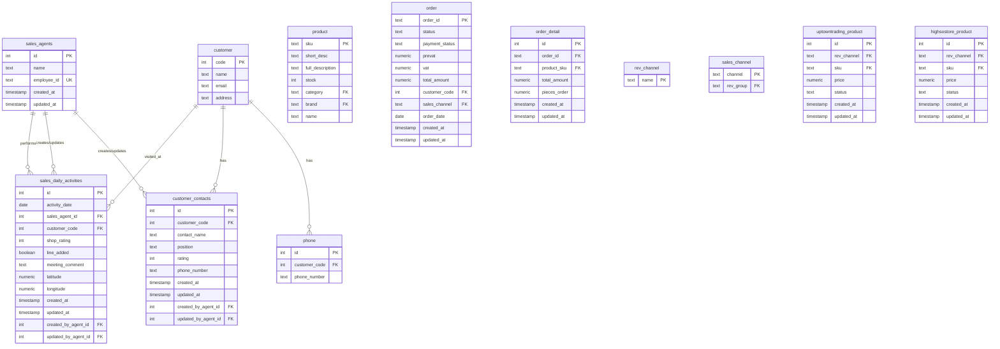

# Database Schema for Sales Report App

## Entity Relationship Diagram

## Key Relationships

1. **Sales Agent Activities**
   - Each `sales_agent` can perform multiple `sales_daily_activities`
   - Each `sales_daily_activities` record is linked to one `sales_agent` (who performed it)
   - Each `sales_daily_activities` record is also linked to the `sales_agent` who created and updated it

2. **Customer Relationships**
   - Each `customer` (shop) can have multiple `sales_daily_activities` (visits)
   - Each `customer` can have multiple `customer_contacts` (people at the shop)
   - Each `customer` can have multiple `phone` numbers

3. **Audit Trail**
   - Both `sales_daily_activities` and `customer_contacts` track who created and updated them
   - This is done via `created_by_agent_id` and `updated_by_agent_id` fields linking to `sales_agents`

4. **Order System**
   - Each `customer` can have multiple `order` records
   - Each `order` can have multiple `order_detail` records
   - Each `order_detail` is linked to a specific `product`

5. **Product Management**
   - Products are stored in the `product` table
   - Website-specific product information is stored in `uptowntrading_product` and `highsostore_product`
   - These tables link to both the `product` table and the `rev_channel` table

## Data Flow for Sales Activity Reporting

1. Sales agent logs in using their `employee_id`
2. Agent selects a customer (shop) they visited
3. Agent records visit details (rating, line added status, comments)
4. Agent's location is captured and stored with the activity
5. Agent can record contact information for people at the shop
6. All data is stored with proper audit trail (who created/updated)

## Phone Number Logic

When a phone number is provided for a customer contact:
1. Check if the phone number already exists for that customer in the `phone` table
2. If it doesn't exist, add a new record to the `phone` table
3. This ensures phone numbers are properly tracked and not duplicated