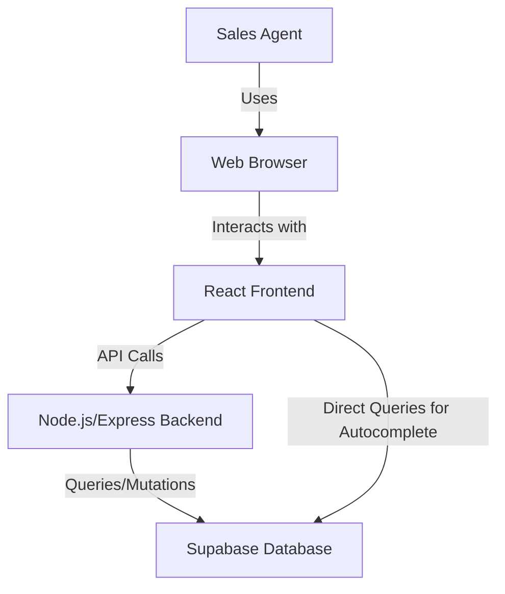
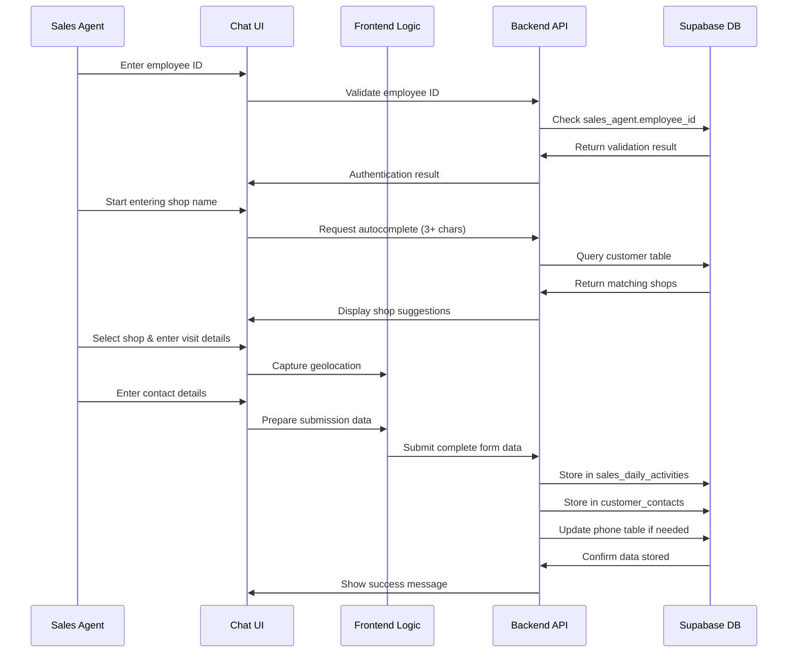

# Sales Report App - Project Summary

## Project Overview

The Sales Report App is a web application with a chat-based interface designed for sales agents to log shop visits, track customer contacts, and record sales activities. The application integrates with a Supabase database to store and retrieve data about sales activities, customer information, and product details.

## Key Features

- **Chat-based Form Interface**: Intuitive, conversational UI for data entry
- **Shop Autocomplete**: Type-ahead suggestions after 3 characters
- **Geolocation Capture**: Automatic location tracking for visit verification
- **Customer Contact Management**: Record and manage shop contacts
- **Phone Number Logic**: Smart handling of customer phone numbers
- **Audit Trail**: Complete tracking of who created and updated records

## Technology Stack

- **Frontend**: React with Vite, React Router, Context API
- **Backend**: Node.js with Express
- **Database**: Supabase (PostgreSQL)
- **Authentication**: Simple employee ID verification
- **Geolocation**: Browser's Geolocation API
- **Form Management**: Custom form state management with React Context

## Project Documentation

This project includes comprehensive documentation covering all aspects of the application architecture, implementation, testing, and deployment:

### 1. [Implementation Plan](implementation-plan.md)
Detailed technical specifications and implementation steps for both frontend and backend components. Includes code examples, component structure, and API endpoint definitions.

### 2. [Database Schema](database-schema.md)
Entity relationship diagrams and detailed descriptions of the database tables, relationships, and data flow. Includes information about the audit trail implementation and phone number management logic.

### 3. [UI Mockups](ui-mockups.md)
Visual representations of the user interface, including the chat-based form flow, input components, and mobile views. Includes design notes and accessibility considerations.

### 4. [Testing Strategy](testing-strategy.md)
Comprehensive testing approach covering unit testing, integration testing, and end-to-end testing. Includes example test cases and testing schedules.

### 5. [Deployment Guide](deployment-guide.md)
Instructions for deploying the application to production environments, including traditional hosting, containerized deployment, and cloud platforms. Includes post-deployment steps and troubleshooting guidance.

### 6. [Project Plan](project-plan.md)
Timeline, resource requirements, risk assessment, and sprint planning for the 8-week development cycle. Includes detailed tasks for each sprint and success criteria.

## Architecture Overview

## Data Flow

## Implementation Timeline

The project is planned to be completed in 8 weeks:

- **Week 1**: Project Setup and Foundation
- **Weeks 2-4**: Core Features Development
- **Weeks 5-6**: Integration and Enhancement
- **Weeks 7-8**: Testing and Deployment

## Getting Started

To begin working on this project:

1. Review the [Implementation Plan](implementation-plan.md) for technical details
2. Set up the development environment as described in the [README](README.md)
3. Follow the sprint plan outlined in the [Project Plan](project-plan.md)

## Next Steps

1. Set up project structure for React frontend and Node.js/Express backend
2. Configure Supabase connection and database access
3. Implement sales agent authentication using employee_id
4. Create chat-based form UI for data entry

## Conclusion

This project summary provides an overview of the Sales Report App and serves as an index to the detailed documentation. The application is designed to be intuitive, efficient, and reliable, helping sales agents record their activities while maintaining a complete audit trail.

By following the implementation plan and project timeline, the development team can efficiently build this application to meet the requirements and provide value to the sales team and the organization.